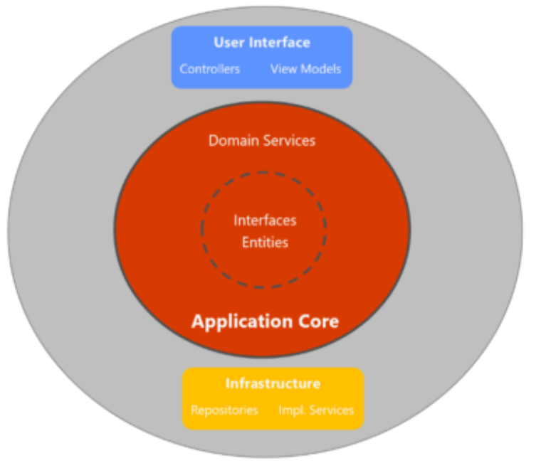
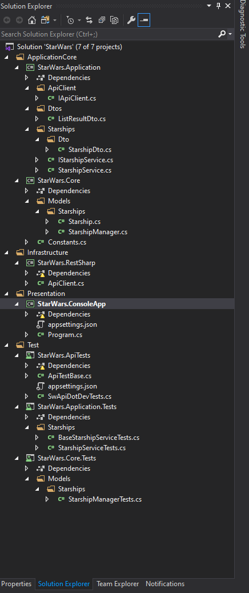
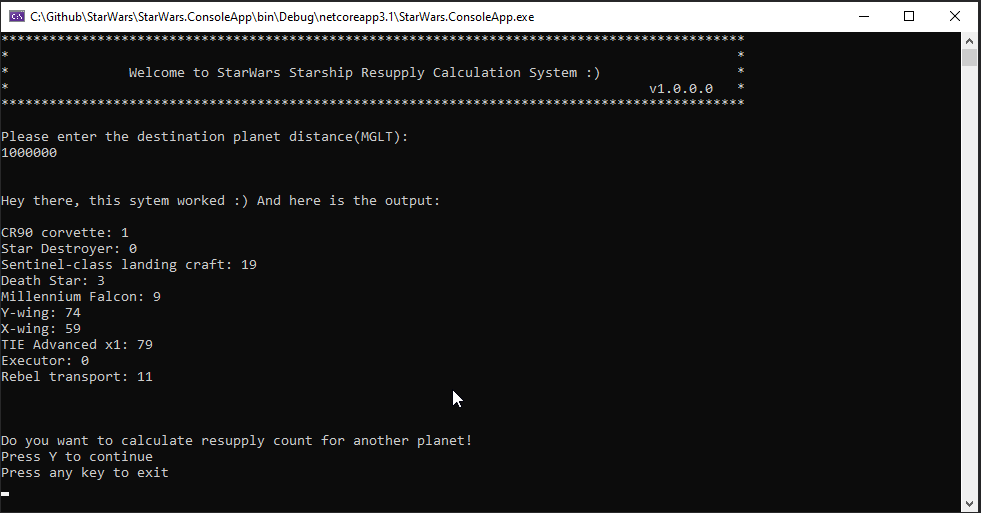
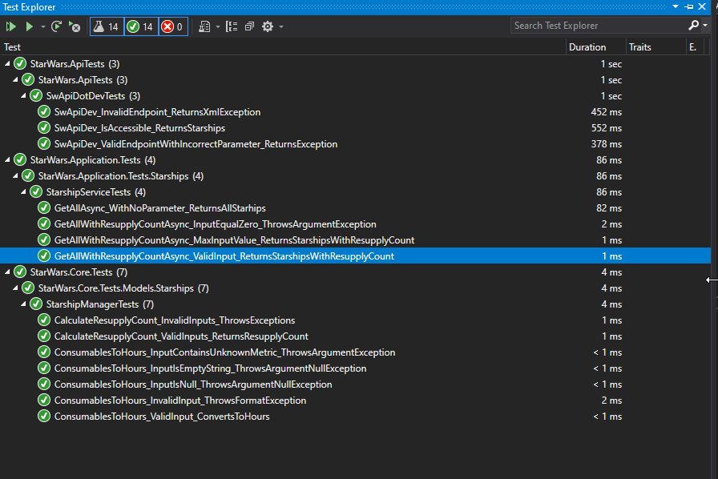

# SW Starship Resupply Calculation System

This project uses API available in https://swapi.dev and shows how industry best practices are applied in .NET Core C# project. 

The source code is developed according to the following best practices:

- SOLID principles
- Clean Architecture
- TDD, Automated Testing(Unit Tests, Integration Tests, API tests)
- SoC
- DDD
- Clean code

## Getting Started

### Code organization and Folder structure

The organization of code is made according to Clean Architecture and DDD layered architecture guidelines. 

Clean Architecture Layers

Folder Structure

### Projects

- ***ApplicationCore/StarWars.Application***: Contains Application services, interfaces and DTO's. 
- ***ApplicationCore/StarWars.Core***: Contains Domain Models, Domain Services and common classes. 
- ***Infrastructure/StarWars.RestSharp***: Contains implementation of IApiClient using RestSharp.
- ***Presentation/StarWars.ConsoleApp***: This is the console app.
- ***Test/StarWars.Core.Tests***: Contains unit tests.
- ***Test/StarWars.Application.Tests***: Contains integration tests.
- ***Test/StarWars.Api.Tests***: Contains api tests.

### Built with

- .NET Core 3.1
- C#
- Moq for mocking
- xUnit for testing
- RestSharp - ApiClient is an implementation with RestSharp, with Dependency Inversion you can use your favourite REST client. 
- and others

### Running the App

Run the StarWars.ConsoleApp project and you should get the following output. 

### Running the automated tests

Open Test Explorer, run all tests and you should get the following output. 

